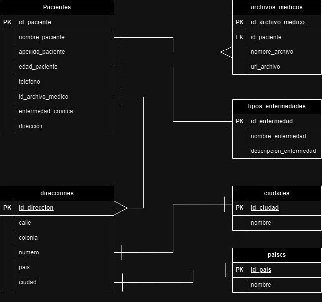

# Base de datos SPDMI-AIA

## *Entidades*

### pacientes **(ED)**
- id_paciente **(_PK_)** (_Integer_)
- nombre_paciente   (_Varhar_)
- apellido_paciente (_Varchar_)
- edad_paciente (_Integer_)
- telefono  (_Varchar_)
- id_archivo_medico (_Integer_)
- enfermedad_cronica    (_Varchar_)
- direccion (_Integer_)

### archivos_medicos **(ED)**
- id_archivo_medico **(_PK_)**  (_Integer_)
- id_paciente **(_FK_)**    (_Integer_)
- nombre_archivo    (_Varchar_)
- url_archivo   (_Varchar_)

### tipos_enfermedades **(ED)**
- id_enfermedad **(_PK_)**  (_Integer_)
- nombre_enfermedad (_Varchar_)
- descripcion_enfermedad    (_Varchar_)

### direcciones **(ED)**
- id_direccion **(_PK_)**   (_Integer_)
- calle (_Varchar_)
- colonia   (_Varchar_)
- numero    (_Varchar_)
- pais      (_Integer_)
- ciudad    (_Integer_)

### ciudades **(EC)**
- id_ciudad **(_PK_)**  (_Integer_)
- nombre    (_Varchar_)

### paises **(EC)**
- id_pais **(_PK_)**    (_Integer_)
- nombre    (_Varchar_)

## Diagrama

### Modelo Relacional de la Base de Datos
